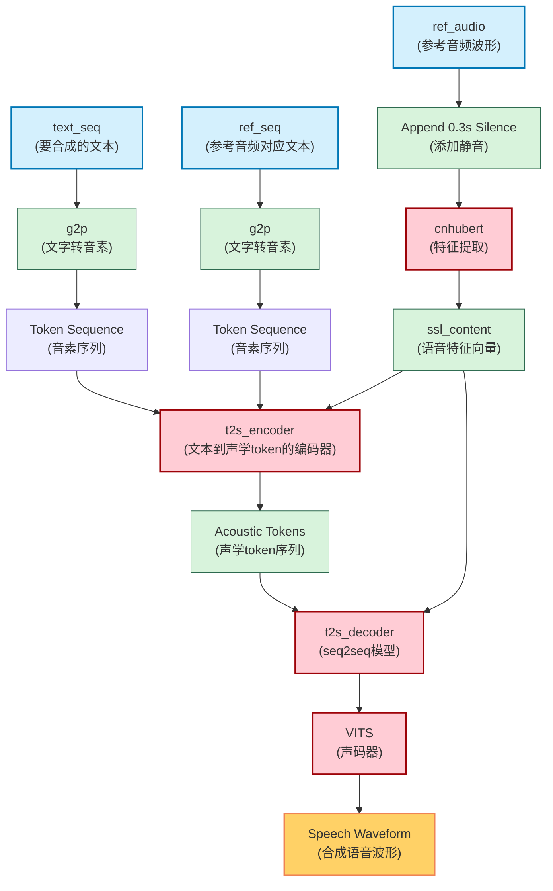

# GPT-SoVITS

## Framework

### 1. 整体架构

GPT-SoVITS 是一种基于 token 的语音合成模型，其核心思想是：

* 将文本转换为声学 token 序列。
* 将声学 token 序列转换为语音波形。

### 2. 主要组成部分

GPT-SoVITS 由以下几个关键模型组成：

* **cnhubert:** 将输入的语音波形转换为特征向量（`ssl_content`）。
* **t2s\_encoder:** 编码器，根据输入的文本（`text_seq`）、参考文本（`ref_seq`）和特征向量（`ssl_content`），生成声学 token。
* **t2s\_decoder:** 解码器，使用 seq2seq 模型，根据编码器生成的声学 token，预测后续的声学 token。
* **VITS:** 声码器，将声学 token 转换为最终的语音波形。

### 3. 数据流

1. **输入:**
    * `text_seq`: 要合成的文本。
    * `ref_seq`: 参考音频对应的文本。
    * `ref_audio`: 参考音频的波形。
2. **文本处理:**
    * 使用 g2p (grapheme-to-phoneme) 工具将 `text_seq` 和 `ref_seq` 转换为音素序列。
    * 将音素序列转换为 token 序列（`symbols.py` 中定义）。
    * 对于中文，使用 BERT 模型提取文本的嵌入向量（`ref_bert` 和 `text_bert`）。
3. **语音处理:**
    * 在 `ref_audio` 末尾添加 0.3 秒的静音。
    * 使用 cnhubert 模型将 `ref_audio` 转换为特征向量 `ssl_content`。
4. **声学 Token 生成:**
    * `t2s_encoder` 接收 `ref_seq`、`text_seq` 和 `ssl_content` 作为输入，生成声学 token。
    * `t2s_decoder` 接收 `t2s_encoder` 生成的声学 token，使用 seq2seq 模型预测后续的声学 token。
    * 使用 top-k 和 top-p 采样方法逐个生成 token，直到生成 EOS (End of Sequence) token (值为 1024)。
5. **语音合成:**
    * 将声学 token 序列输入到 VITS 声码器中，生成最终的语音波形。

### 4. 技术细节

* **Token:** 声学 token 共有 1025 种类型，其中 1024 表示 EOS。
* **采样:** 使用 top-k 和 top-p 采样方法控制生成 token 的随机性。
* **语言:**
  * 日语：g2p 转换不使用重音标记。
  * 中文：使用 BERT 嵌入向量。
  * 日语和英语：BERT 嵌入向量用零填充。

### 5. 个人理解

* **cnhubert:** 提取语音特征，为后续的文本到语音转换提供语音信息。
* **t2s\_encoder 和 t2s\_decoder:** 将文本信息转换为声学 token，是整个模型的核心。
* **VITS:** 将声学 token 转换为语音，保证合成语音的质量。
* **Token:** 将连续的语音信号离散化，方便模型处理。

### 6. 架构图

## 预期调整

1. 训练/推理更清晰的划分，一次训练好以后基本就只剩推理了

## 整合包操作流程

> 总得先回顾一下这项目在干嘛吧，我记得变声那个选项已经搁置了很久了，半年前就是“施工中静候佳音”，现在还是施工中
> 不知道是不是因为顶层代码太乱了，哈哈
> 但对于小白来说，确实挺好用的

### 0 前置数据集获取工具

* UVR5提取干声(+降噪？降噪和切割顺序有什么讲究吗？)
  * 使用命令行打开：`tools/uvr5/webui.py`，已经写好了
  * 这里逻辑可以保留也可删去
    * 删去：专门做GPT-SoVITS的**推理**优化，其实整个数据集处理部分都可以丢掉
    * 保留：可以加入其他适配的新模型(但应该也不如客户端多)
      * 提取人声结束后需要及时回收显存
* 切割音频
  * `tools/slice_audio.py`+`tools/slicer2.py`(核心代码)，保留
  * 加入命令行传参
* **数据集打标**
  * 使用fast-whisper(需要校对)
    * 教程提到"SubFix一堆bug"，注意一下 NOTE
  * **或者**：[字幕标注](https://www.yuque.com/baicaigongchang1145haoyuangong/ib3g1e/pqn7zn003kduyye2?singleDoc#)，不仅TTS可用，微调LLM也可以用！

### 1 TTS模型训练

* 微调训练：各种调参
  * 调参怎么优化？

### 2 TTS变声

他们还没